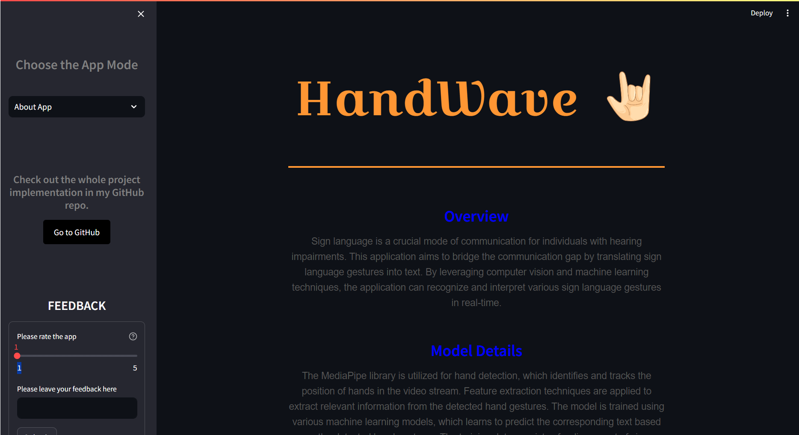
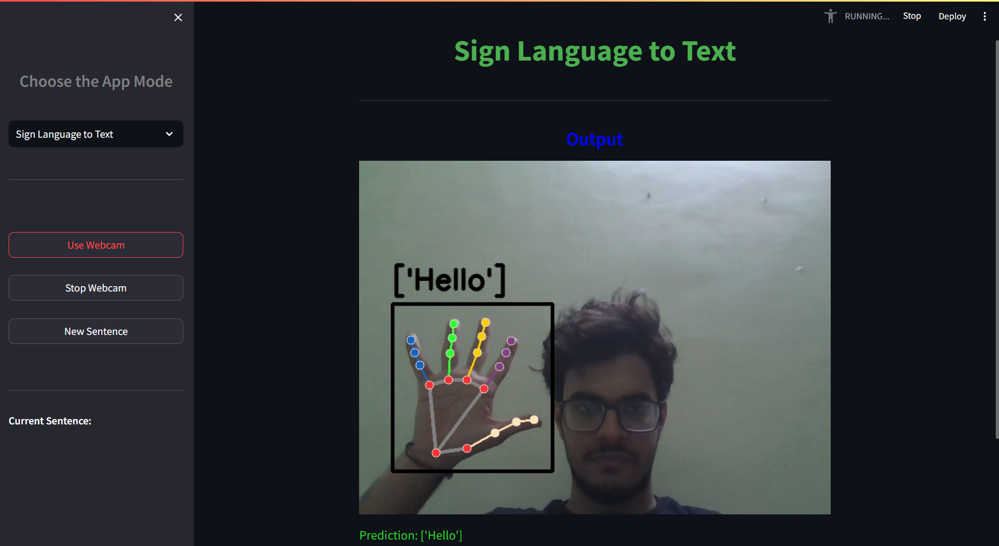

<h1 align="center">HandWave
</h1>

## Overview
This project aims to detect sign language gestures using the <b>MediaPipe</b> library and a trained <b>Random Forest (RF)</b> model. The detected signs are then converted into text for better accessibility.
 

  
 

## Features
- Real-time sign detection using webcam or video input.
- Preprocessing of hand landmarks using MediaPipe.
- Classification of hand gestures using the trained RF model.
- Text output corresponding to the detected sign.

  
 

## Requirements
- Python 3.7+
- OpenCV
- MediaPipe
- scikit-learn (for RF model)
- NumPy
- Download the requirements.txt file for better experience.

## Installation
1. Clone this repository: <b>git clone https://github.com/JATINDULANI31/Handwave.git</b>
2. Install the required packages: Using <b>requirements.txt</b> file.

## Steps
1. cd sign-detector
2. pip install -r requirements.txt
3. Write <b>"streamlit run main.py"</b> on the terminal. 
   
## Set up a virtual environment(Optional)
1. python -m venv venv
2. source venv/bin/activate  # On Windows, use `venv\Scripts\activate`

## Usage
1. Run the main script: Enter <b>streamlit run main.py</b> in your terminal. Make sure that you are in the desired path of the folder that is you are in the folder path.
2. Position your hand in front of the webcam or provide a video input.
3. The detected sign will be displayed on the screen, along with the corresponding text.

## Data Collection 
1. Collected a dataset of hand gestures in sign language of around 70k samples. Each sample include hand landmarks (extracted using MediaPipe) and there corresponding class(letter). 
(For references u can see the <b>Data Collect</b> folder.)

## Training the ML Model
1. Preprocessed the hand landmarks (normalize, flatten, etc.).
2. Trained an RF classifier using scikit-learn.
3. Saved the trained model for inference. 
(For references u can prefer for the <b>sign_detection.ipynb</b> file in the Training Folder.)

## Acknowledgments
- MediaPipe
- Scikit-learn
- OpenCV
- Streamlit
